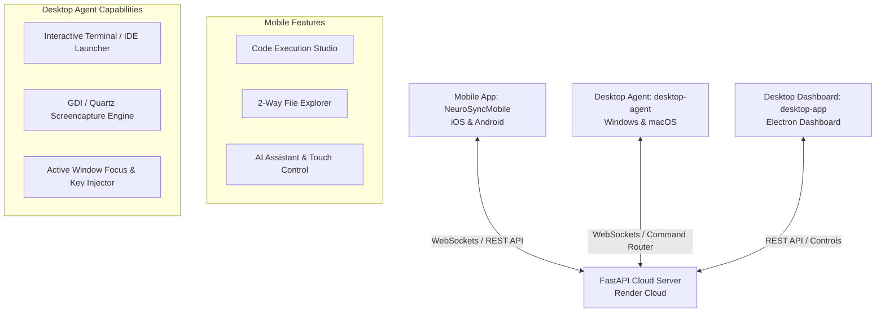

# 🧠 NeuroSync — Cross-Platform Remote Control, Code Studio & Telemetry Ecosystem

[](https://github.com/sumit-9604/Neurosync)
[](https://github.com/sumit-9604/Neurosync)
[](https://github.com/sumit-9604/Neurosync)

**NeuroSync** is a unified, cross-platform remote desktop automation, remote code execution studio, file transfer engine, and telemetry system designed for **Windows**, **macOS**, **iOS**, and **Android**.

---

## 🌟 Key Features

### 💻 1. Mobile-to-Desktop Remote Code Studio
- **Multi-Language Execution**: Run **Python** 🐍, **Node.js** 🟩, **Shell / Bash** 💻, and **PowerShell** ⚡ scripts remotely from your mobile device.
- **3 Execution Modes**:
  1. 🖥️ **Interactive Terminal Window Mode**: Spawns a real, visible PowerShell/CMD window (Windows) or Terminal window (macOS) on the desktop. Uses your local Python virtualenvs (`venv`/`conda`), installed packages (`pip`/`npm`), and supports GUI windows (Matplotlib, OpenCV, Pygame).
  2. 💻 **Open in IDE Mode**: Transfers code files and opens them directly in **VS Code**, **PyCharm**, **Sublime Text**, or **Notepad** on your Desktop.
  3. ⚡ **Background Streamer Mode**: Executes in the background and streams `stdout`, `stderr` (highlighted in red), `exit_code`, and execution time back to your phone.

---

### 📂 2. 2-Way Remote File Explorer
- **Cross-Device Storage Browsing**:
  - Browse mobile storage (**Camera / DCIM**, **Pictures**, **Downloads**, **Documents**, **Internal Storage `/storage/emulated/0`**).
  - Browse remote desktop file systems (**Home `~`**, **Documents**, **Downloads**, **Pictures**, **Desktop**).
- **Chunked File Transfers**: Fast, reliable file downloads using 256KB chunk streaming.
- **Clean UI**: Persistent target device dropdown selector with real-time `ONLINE` / `OFFLINE` status badges and zero popup prompt spam.

---

### 🤖 3. AI Assistant & Active Window Typing
- **Active Application Focus**: Automatically focuses open windows (**Chrome**, **VS Code**, **Notepad**, **Terminal**) on Windows & macOS (`Win32` & AppleScript `osascript`).
- **Direct Active Window Typing**: Types text directly into the currently active application without opening Notepad unless explicitly requested.
- **Chrome Search & Navigation**: Directly opens URLs or formats Google web searches in Chrome.

---

### 📸 4. High-Resolution Screen Capture
- **Windows GDI Capture Engine**: Uses GDI BitBlt with BGRX decoding and desktop thread attachment (`OpenInputDesktop` / `SetThreadDesktop`) to capture crisp desktop screenshots.
- **macOS Native Screencapture**: Uses Quartz `screencapture -x` to capture full-resolution Retina screenshots silently.

---

### 📊 5. Real-Time Telemetry & Devices Dashboard
- Live CPU %, RAM %, Disk %, and Network I/O metrics polled directly from desktop agent telemetry.
- Permanent user account system with JWT authentication and Google OAuth (`/api/v1/auth/google`).

---

## 🏗️ System Architecture



---

## 📁 Repository Structure

```
NeuroSync/
├── NeuroSyncMobile/            # React Native Mobile App (Android & iOS)
│   ├── android/                # Android Native Configuration & Permissions
│   ├── ios/                    # iOS Native Configuration
│   └── src/
│       ├── navigation/         # AppNavigator (Screen Stack)
│       ├── screens/            # CodeRunnerScreen, FileExplorerScreen, DevicesScreen, etc.
│       ├── services/           # MobileAgentService, apiClient, authService
│       └── theme/              # Neural Dark Theme Tokens
│
├── desktop-agent/              # Python Desktop Agent Daemon (Windows & macOS)
│   ├── main.py                 # WebSocket Connection & Heartbeat Loop
│   └── agent/
│       ├── command_router.py   # Command Registry & Action Dispatcher
│       └── automation/         # Automation Engines
│           ├── code_executor.py      # Subprocess & Interactive Terminal Launcher
│           ├── keyboard_controller.py# GDI / Quartz Screencapture & Key Injection
│           ├── app_launcher.py       # Cross-Platform Window Focus & App Lifecycle
│           ├── mouse_controller.py     # Mouse Movement & Clicks
│           └── file_transfer_engine.py# 2-Way Chunked File Transfer Engine
│
├── desktop-app/                # Electron Desktop Control Dashboard
│   ├── main.js                 # Electron Main Process & IPC Handlers
│   └── renderer/
│       └── index.html          # Cyberpunk Neural Control Interface
│
└── backend/                    # FastAPI Cloud Server (Hosted on Render)
    └── app/
        ├── api/v1/             # Auth, Devices, Command Router & Telemetry Endpoints
        └── services/           # Device Manager & WebSocket Relays
```

---

## 🛠️ Installation & Setup

### 1. Backend Server (FastAPI)
```bash
cd backend
pip install -r requirements.txt
uvicorn app.main:app --host 0.0.0.0 --port 8000
```

### 2. Desktop Agent (Windows & macOS)
```bash
cd desktop-agent
pip install -r requirements.txt
python main.py
```

### 3. Desktop Control App (Electron)
```bash
cd desktop-app
npm install
npm start
```

### 4. Mobile App (React Native)
```bash
cd NeuroSyncMobile
npm install
# Run on Android
npx react-native run-android
# Run on iOS
npx react-native run-ios
```

---
